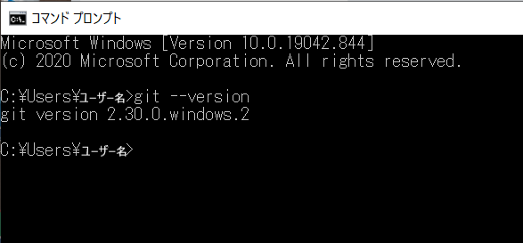
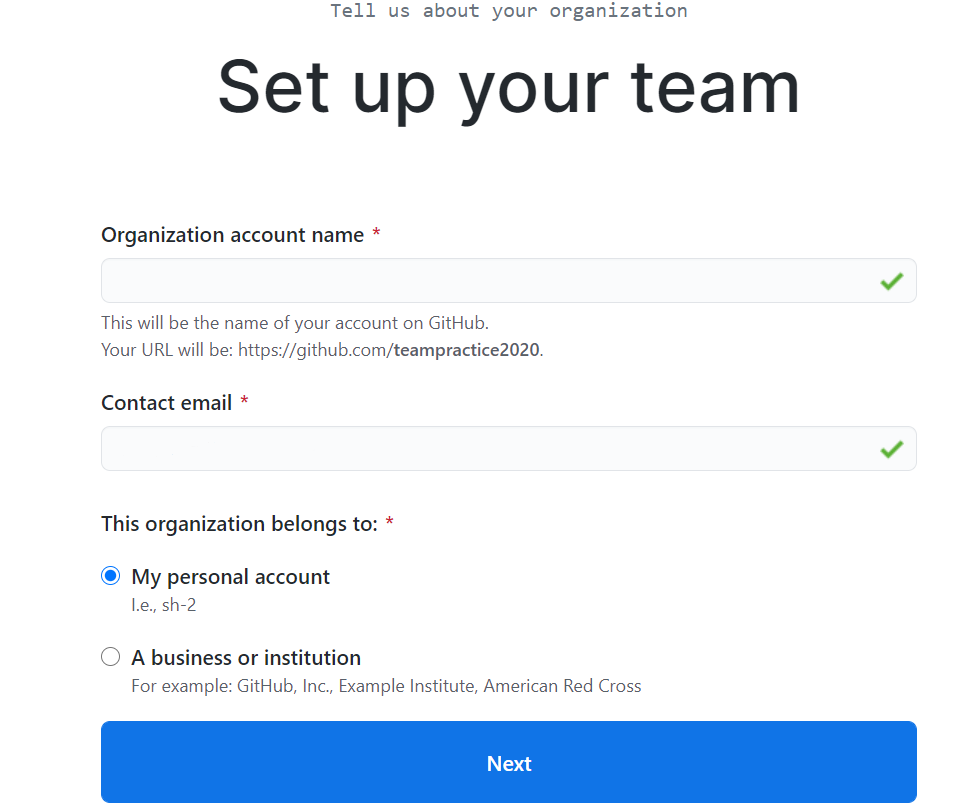
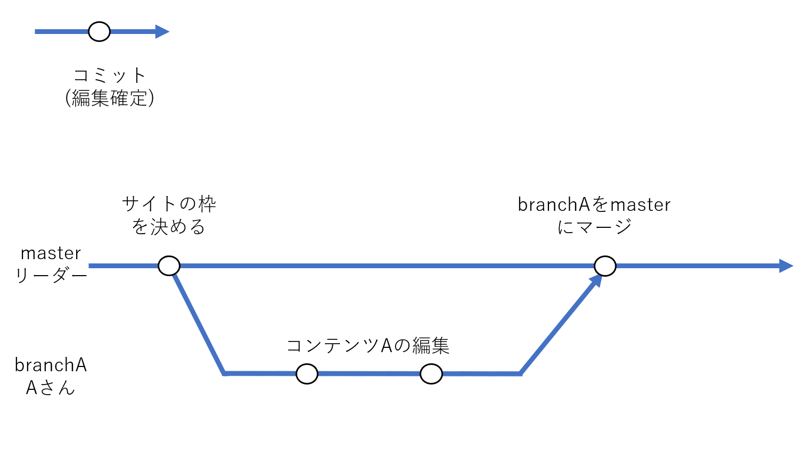
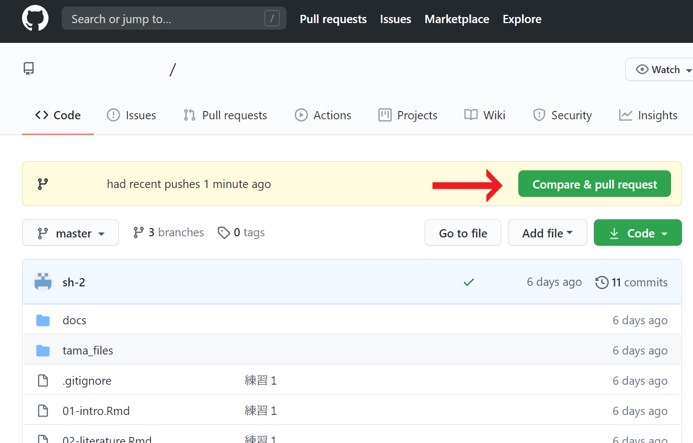
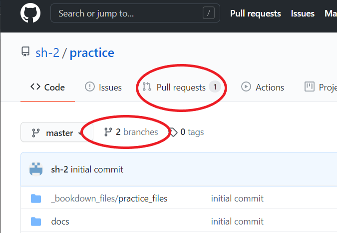
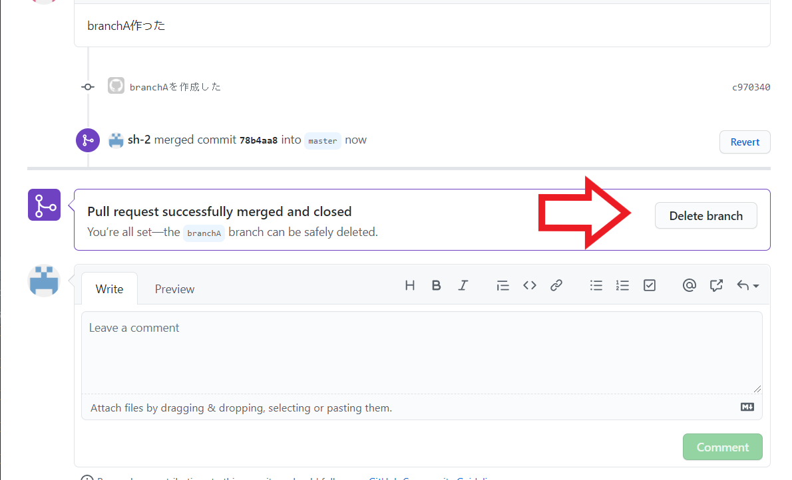
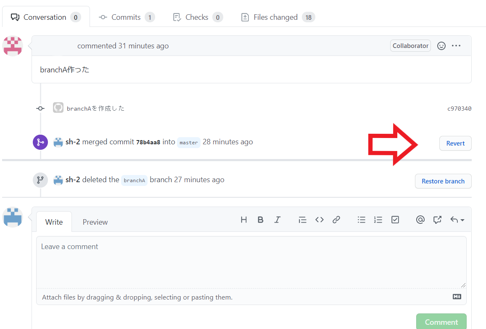

--- 
title: "bookdownとGithubでWebサイト制作"
author: "Sh-2"
date: "`r Sys.Date()`"
site: bookdown::bookdown_site
documentclass: book
bibliography: [book.bib, packages.bib]
biblio-style: apalike
link-citations: yes
description: "RのbookdownパッケージとGit / Gitbubを使ってWebサイトを共同で制作するための解説です。個人で作る際も参考になると思います。"
---
# 初めに {-}
Rのbookdownパッケージを使えばWebサイトが作ることができます。このサイトではRstudioとGithubを使って、その方法を説明していきます。**とりあえずできる**ことを目的として書いており、細かい説明は極力省きました。もしかすると間違い等あるかもしれません。  
chapter 4まで読めば、webサイト制作の大枠は分かると思います。それ以降は共同でwebサイトを制作する方法について説明していきます。

<br />

このサイト自体がbookdownで作られています。RやRstudioに慣れている人は、このbookdownで簡単にサイトを立ち上げられると思います。  
サイトを立ち上げる方法は、他にも色々あるのでこの方法にこだわる必要はありません。

<br />

**想定読者**  

+ bookdownを使いたい人
+ webサイトを作ってみたい人
+ 共同でサイトを制作・管理したい人
+ Git初心者


**作業環境 2021年3月現在**  


* Windows 10 64bit  
* git version 2.30.0  
* R version 4.0.3  
* Rstudio 1.4.1103  

<!--chapter:end:index.Rmd-->

# 事前準備
以下3つのインストールとGitHubの登録をしてください。  
インストールの際は、すべてデフォルトでOKです。  

**R**  
<https://cran.r-project.org/>

**Rstudio**  
<https://rstudio.com/products/rstudio/download/>

**Git**  
<https://gitforwindows.org/>  

<br />

**GitHubの登録**  
<https://github.com/>


<br />

  
Gitをダウンロードしたら、**コマンドプロンプト**を起動します。windowsに標準で付属されているので、デスクトップ左下の検索バーに**「コマンドプロンプト」**と打てば出てくるはずです。  
コマンドプロンプトの代わりにGit Bashを利用しても構いません。Git BashはGitをダウンロードした際に付属してきているはずです。  
今後よく利用するので、どちらかを起動しやすい場所に置いておくことを薦めます。  

Gitは初期設定が必要なので、設定します。  
まずGitが正常に動くかどうかを確認します。以下のコマンドを打ちEnterを押し、**git version ~~~**と表示されれば問題ありません。
```
git --vesrsion
```



次に、以下のコマンドを実行してください。ユーザー名とメールアドレスは直接見られることはないため、自分の好きなもので構いません。

```
git config --global user.name "ユーザー名"
```
```
git config --global user.email メールアドレス
```

これで初期設定は終了です。次に使う時まで、コマンドプロンプトはそのまま閉じて構いません。

<!--chapter:end:chapter01.Rmd-->

# bookdownの準備

## bookdownの環境構築
Rstudioを開きます。consoleに`install.packages("bookdown")`と入力します。（下の画像参照）

 
エラーがなければ、bookdownがインストールされます。  
このbookdownパッケージでWebページなどを簡単に作ることができます。

<br />

次にbookdownを利用できるprojectを作ります。画面右上のproject (None)を選択します。


順に  
New Project...  
↓  
New Diretory  
↓  
Bookdown Project using bookdown  
を選択。  

<br />
Directory nameは例として**practice**とします。(名前は何でも構いません。)  
Create project as subdirectory of: はフォルダを置く場所を選択します。デスクトップなど自分の使いやすい場所を選択しましょう。  

<br />

ここで、このプロジェクトフォルダのGitの設定もしておきます。  
画面中央上部のToolsからProject Options...を選びます。


<br />


GIT/SVNのVersion control system:を(None)からGitに変更します。OKを押すとRstudioの再起動を求められるので、再起動させましょう。  
（この操作は`git init`と同じような操作です。）

<br />

これで、このpracticeというフォルダはGitの管理下に置かれることになりました。（Gitについてはまだよくわからなくて構いません。）


## bookdownで使用されるファイル
今、Rstudioの右下の画面には現在のディレクトリ内のフォルダが表示されていると思います。  
以下ようなファイルが、practiceプロジェクトに入っています。

これはbookdownがデフォルトで用意してくれるファイルです。これらにWebページの内容や設定を記述することでwebページが作られます。後で中身を書くので、今は特に触る必要がありません。以下に簡単に説明だけしておきます。

<br />

+ .Rmd:ページの中身になります。
    + index.Rmd：サイトのトップページになります。  
+ _bookdown.ymlと_output.yml：出力方法や、全体の設定を行います。  


<br />

後でGitHubでの公開を簡単にするため、以下のように_bookdown.ymlに記述します。  
```
output_dir: "docs"
```
（Githubはdocsフォルダの中身をサイトとして公開することができます。今は分からなくてよいので無心で記述してください。）


<!--chapter:end:chapter02.Rmd-->

# Webページの作成～公開
webページを立ち上げてみるところまで一気にやってみましょう。


## HTML等を作成
まずは、index.Rmdを開いてknitをしましょう。


<br />

すると以下のようなプレビュー画面が現れます。
<br />

これはbookdownで用意されている、webページのテンプレートです。  
プレビューをしているだけなので、まだHTML等の公開に必要なファイルは出来ていません。  

<br />
次にBuildを行います。これでHTML等のファイルが作られます。BuildはRstudioの画面の右上から可能です。  
さっそくBuild Bookをクリックしましょう。

<br />
少し待つとBuildが終わり、practiceフォルダの中にdocsというフォルダができていると思います。(chapter 2で出力先を"docs"に指定したため。）　　

<br />

後はdocsの中身をサーバーに公開すれば、ひとまずwebサイトの完成です。  
「サーバー?」と思った方は心配ご無用です。GitHubがすべてやってくれます。

## (Git / Githubについて)
ここからGitとGitHubを使っていきます。  
Git / Githubについてはchapter 7で取り扱っているので、気になる方はそちらを先にご覧ください。  
chapter 7を読まなくても操作を追うだけで、一応サイトは完成できます。


## GitHubにアップロード
さて、Gitを使ってみましょう。  
コマンドプロンプトを開いてください。(Git bashでもOKです。)

<br />


最初に作業を行うpracticeフォルダまで移動します。（このpracticeフォルダは、自分のPC上にあるという意味でローカルリポジトリと呼ばれます。）

コマンドプロンプト以下のコマンドを打ち。enterを押します。
```
cd practiceまでのパス   #ディレクトリを指定先に移動する操作。change directoryの略。
```


<br />
（chapter 2の操作でpracticeフォルダのGit initを終えているので)  
次にローカルレポジトリでステージングとコミットをします。(Gitに編集を確定させる操作。)  
以下のようにコマンドを打ちます。
```
git add .   #ステージング（ファイルの編集をGitが把握。）
```
```
git commit -m "コメント"    #編集の確定。コメントには編集内容などを書いておく。
```
これでローカルリポジトリ編集内容が確定しました。(ほぼ編集してませんが。)


<br />
最後に、GitHubにフォルダをアップロードします。  
まず、GitHubにリモートリポジトリを作ります。このリモートレポジトリにpracticeフォルダをアップロードすることで、その中身を公開できるようになります。
GitHubにサインインし、緑色のNEWをクリックしましょう。


<br />
practiceというリモートレポジトリを作ります。  
（Publicを選択しないとWebサイトは公開できません。）


<br />


作成されたリモートレポジトリのURLをコピーします。(HTTPSを選んだままで構いません。)

<br />

コマンドプロンプトに戻り、以下のコマンドを打ちます。このコマンドでローカルリポジトリのフォルダがリモートリポジトリにアップロード(push)されます。  
初回のpushのみGitHubのログインを求められます。
```
git remote add origin リモートリポジトリのURL    #ローカルとリモートの関連付け
```
```
git push origin master    #リモートへアップロード
```


<br />

公開まであと一息です。

<br />


ここまで終えた後、GitHubのページを更新するとファイルがアップロードされています。  


<br />

そしてGitHub上でSettingのページに行き、下にスクロールするとGitHub Pagesの項目があります。  
`branch: master`、`/docs`に設定しSaveを押すとURLが発行②されます。


<br />
しばらく待つとURL②のページに飛ぶことができます。以上でbookdownを使ったWebページの公開が完了です。  
もししばらく待っても公開ができない場合は、何かミスがあるはずです。


## 今後の更新作業

一度GitHub Pagesで公開されれば更新は簡単です。  
<br />

practiceフォルダ内のファイルを編集  
↓  
Bulidを行う  
↓  
コマンドプロンプトで以下のコマンドを打つ。  
```
git add .
```
```
git commit -m "コメント"
```
```
git push origin master
```

これで自動的に更新されます。


<br />
具体的な編集方法は次のchapterで見ていきます。

<!--chapter:end:chapter03.Rmd-->

# ページの編集
このchapterでは、テンプレを書き換えて自分の好きなサイトを作っていきます。

<br />

すべて説明しきれないため、あまり深入りせずに簡潔に説明します。詳しくは**[公式](https://bookdown.org/yihui/bookdown/)**で確認お願いします。  
もしくは**[私のリモートリポジトリ](https://github.com/sh-2/Rstudio_bookdown/archive/master.zip)**から、このサイトのプロジェクトフォルダをダウンロードして、見比べながら作業してみてください。

<br />

## _bookdown.yml

`output_dir: "docs"`を追記するだけで構いません。(chapter 2参照)  
Githubはdocsというフォルダがあれば、その中身をWebサイトとして公開してくれるため、このように指定しています。  


## _output.yml

```
bookdown::gitbook:
  css: style.css
  config:
    toc:
      before: |
        <li><a href="./">　ここにサイトタイトルを書きます　</a></li>
      after: |
        <li><a href="https://github.com/rstudio/bookdown" target="blank">Published with bookdown</a></li>
    download: ["pdf", "epub"]
bookdown::pdf_book:
  includes:
    in_header: preamble.tex
  latex_engine: xelatex
  citation_package: natbib
  keep_tex: yes
bookdown::epub_book: default
```

サイトタイトルの部分に好きなタイトルを書きましょう。このサイトだと左上の**「bookdownとGitHubでWebpage制作」**の位置に当たります。  
<br />
_output.ymlでは出力されるhtmlの構成を変える設定などを記述できます。(html widgetを多く使う場合などで、必要になるかもしれません。多くの場合、気にする必要はありません。)


## .Rmdファイル（Rマークダウンファイル）
Rmdファイルは本文に当たる部分です。マークダウン記法で記入していき、これがbuild時にhtmlに変換されます。  

マークダウンの書き方は、検索すれば良いサイトが多くあります。自身で調べてみてください。参考に一つ挙げておきます。  
[Qiita マークダウン記法 一覧表・チートシート](https://qiita.com/kamorits/items/6f342da395ad57468ae3)


### index.Rmd
このサイトの**「初めに」**のようなトップページに当たります。  
本文はマークダウン記法で記入しますが、index.Rmdのみ`---`で囲まれた中に設定を書く必要があります。  
とはいえ、デフォルトのものを書き換える程度なので、簡単にできます。例としてこのサイトのindex.Rmdを載せておきます。


```
---     この---に囲まれた部分はindexの設定になります。
title: "bookdownとGithubでWebサイト制作"    タイトル
author: "Sh-2"    筆者の名前
date: "`r Sys.Date()`"    更新日が自動で取得されます
site: bookdown::bookdown_site 
documentclass: book
bibliography: [book.bib, packages.bib]
biblio-style: apalike
link-citations: yes
description: "RのbookdownパッケージとGit / Gitbubを使ってWebサイトを共同で制作するための解説です。個人で作る際も参考になると思います。"     サイトの説明部分になります。
---

(ここから下がマークダウン記法で書く本文となります。)

# 初めに {-}
Rstudioでbookdownパッケージを使ってWebサイトを作る説明書として、このサイトを作りました。**とりあえずできる**ことを目的として書いており、細かい説明は極力省きました。もしかすると間違い等あるかもしれません。  
chapter 4まで読めば、webサイト制作の大枠は分かると思います。それ以降は共同でwebサイトを制作する方法について説明していきます。
```

### その他Rmdファイル
テンプレートの`01-intro.Rmd`などは消してしまい、自身がわかりやすいRmdファイルを作り直すことをお勧めします。Rstudioの左上から新しいRmdファイルを作ることができます。  
(buildする際はRmdの名前順にhtmlが生成されるため、命名には注意してください。ここでは触れませんが_bookdown.ymlで順番を指定することもできます。)  


<br />

R markdown...を選択した後、TitleとAuthorを求められますがすぐに消すので、書かなくて構いません。  

Rmdファイルが作られると,以下のように色々と書かれていると思いますが、


すべて消してください。そして以下のようにチャプタータイトルから書き始めます。


<br />

```# タイトル```の後にいきなり本文から書き始めて構いません。タイトルの部分がchapter名となり、それ以降が本文となります。  
bookdownでレンダリングする際、Rmdファイルは名前順でページになるので、注意してください。  

例としてchapter 4のRmdファイルを一部載せます。  
```
# ページの編集
このchapterでは、テンプレを書き換えて自分の好きなサイトを作っていきます。

<br />

すべて説明しきれないため、あまり深入りせずに簡潔に説明します。詳しくは**[公式](https://bookdown.org/yihui/bookdown/)**で確認お願いします。  
もしくは**[私のリポジトリ](https://github.com/sh-2/Rstudio_bookdown/archive/master.zip)**から、このサイトのプロジェクトフォルダをダウンロードして、見比べながら作業してみてください。

<br />

## _bookdown.yml

`output_dir: "docs"`を追記するだけで構いません。(chapter 2参照)  
Githubはdocsというフォルダがあれば、その中身をWebサイトとして公開してくれるため、このように指定しています。  

```

## Build
ここまでできれば、あとはBuildするだけです。  
knitでプレビューしておき、問題がなければBuild Bookをクリックしましょう。(index.Rmdのknitは必須です。)

## GitHubへの更新
重複しますが、以下のコードをコマンドプロンプトで打てば更新されます。Build Bookが完了した後に行いましょう。
```
git add .
```
```
git commit -m "コメント"
```
```
git push origin master
```
pushのあとで、しばらく待ってからサイトを見てみましょう。更新されているはずです。


<br />
ここまでで、webサイトの作り方は一通り終わりです。より詳しい設定をする場合、**[公式](https://bookdown.org/yihui/bookdown/)**などで各自確認願います。特に_bookdown.ymlや_output.ymlはまだまだ設定できる項目が多くあります。  

これ以降のchapterでは共同でサイトを作っていく方法を紹介して行きます。（ここまででサイトは作ることができるため、必要のない方は以降のchapterを読む必要はありません。）

<!--chapter:end:chapter04.Rmd-->

# webサイト共同制作(branch無し)

## 共同のorganizationを作成する

まずはGitHubで共同でリポジトリを管理できるorganizationを作りましょう。  


<br />
次の画面ではFreeのプランを選んでいただいて構いません。  

<br />
その次はSet up画面です。それぞれ入力してください。  
emailはリーダーのアドレスを選択すればよいでしょう。organizationのタイプはpersonal accountで大丈夫です。  

<br />

以下の画面で共同制作者を招待します。もしここでできなくても後での招待も可能です。


<br />

次の画面でアンケートのようなものが表示されます。答えても答えなくてもどっちでも大丈夫です。 

<br />

その後、以下の画面が表示されればorganizationの完成です。


<br />

最後に共同で管理するため、設定を行いましょう。
SettingからMember privilegesを選択し、Base permissionsをwriteに変更しておきましょう。

<br />
以降、このorganizationの中でリポジトリを作成すると、参加者が共同で使うことができるリモートリポジトリになります。リーダーはこのリモートリポジトリに、bookdownのプロジェクトをアップロード(push)しましょう。


## 共同でリモートリポジトリを使う(初回)
共同制作者は、リーダーが作ったリモートリポジトリを自分のローカル環境にも持ってくることで編集することができます。

```
cd パス   #デスクトップなどを作業しやすい場所まで移動
git clone URL   #URLはリモートのものをコピペ。リポジトリが複製される。
```

これでデスクトップ上に、リモートリポジトリのフォルダが複製されます。  
このフォルダの中身のRmdなどを編集しましょう。knit, Build Bookを行ったら、pushまで行います。


```
git add .
git commit -m "コメント"    #他の制作者が分かりやすいコメントが望ましい
git push origin master
```

これで共同のリモートリポジトリに編集内容がアップロードされました。

## 共同でリモートリポジトリを使う(2回目以降)

共同のリモートリポジトリで他の誰かがpushを行っても、`git clone`で複製されたローカルリポジトリには、その変種内容は反映されません。作業を始める前には必ず、`git pull`を行いましょう。

```
git pull origin master    #リモートの最新情報をローカルに反映
```

この後で編集を行いpushしましょう。  

<br />

共同リモートリポジトリのマスターブランチ(origin master)にアップロードする方法は比較的簡単です。ただし皆が同じブランチを扱うため競合が起きたり、いくつか問題があります。  
問題を起こさないためには、pushしたあとは必ずメンバーに伝える。`pull→push`の一連の流れの中で、他の人のpushがされないようにする。などに注意しましょう。　　

<br />

次の章ではbranchを使った共同作業の説明をします。  
ここまででも十分、共同でサイトを更新できます。branchの概念は少し難しいので、以降読まなくても大丈夫です。

<!--chapter:end:chapter05.Rmd-->

# webサイト共同制作(branch有り)

chapter 6 ~ 9ではbranchを用いて、共同でWebサイトを作る方法を解説します。共同でリポジトリを管理できるorganizationを作らなければいけない点は変わらないため、chapter 5を参考にして作っておいてください。  　

<br / >

chapter 5ではbranchを用いずに共同で作業する方法を説明しました。chapter 5のやり方だと簡単なのですが、マスターブランチにそのまま編集内容が更新されるため、ミスした編集内容が公開される可能性があります。branchを用いると、こういう可能性を減らすことができます。（ただし少し難しくなります。）

Git / Githubにどうしても慣れない場合は、完成したRmdファイルをリーダーに送る or　マスターブランチ(chapter 5の方法)をそのまま更新する、などした方が楽かもしれません。

<br />


今回想定している作業の進め方は以下の通りです。 

+ 一つのサイト内に複数コンテンツ（≒chapter）を載せる。
+ コンテンツごとに作業分担される。
+ サイト全体を仕上げるリーダー的存在がいる。

要するに、**コンテンツを持ち寄ってサイトを作る**ような場合です。紹介する方法はwebサイト制作の作業分担の仕方によって変わるため、あくまで参考程度にしてください。  


<!--chapter:end:chapter06.Rmd-->

# Git/GitHubの使い方について
次のChapterから本格的にGitを使っていきます。Gitを使える方は飛ばして構いません。  

<br />

このページではGitを説明しきれないため、参考の動画を載せておきます。 個人的にGitの大枠を掴むのには良かったと思うものです。branchのことを理解していると、これからの話が分かりやすいです。

<br />
Gitをざっくり解説してくれる動画です。↓
[](http://www.youtube.com/watch?v=69FE07KnL7Y "【プログラミング超入門】GitHubの使い方｜初心者向けにアカウント登録から解説！")

<br />
もう少し詳しめの解説動画です。  
こちらのbranchの知識が共同作業では必要です。↓
[](http://www.youtube.com/watch?v=LDOR5HfI_sQ "【Git入門】Git+Github使い方入門講座🐒Gitの仕組みやブランチの運用ルールまで、開発現場で必要な知識を完全解説！デザイナーやプログラマー必見のGit入門！")


<!--chapter:end:chapter07.Rmd-->

# Git & GitHubを中心に共同制作

## 作業フロー
<br />
以下のように作業環境を設定します。

+ master：最終的に完成形となる公開用の本流。リーダーが管理。
+ branchA：コンテンツAを作るブランチ。Aさんが担当。


このように各々がブランチで担当コンテンツを作り、完成したらmasterにマージするような流れで行っていきます。


そもそも何故ブランチを使うかというと、masterに各々がpushしてしまうとそれぞれの編集が被ってpushできなかったり、誤った編集でmasterをダメにしてしまうことを避けるためです。ブランチでの作業はmasterには影響を与えないため、各自編集を行って構いません。  

<br />

## リモートリポジトリを自分の端末にコピー
ではAさんを例にとって、Aさん視点で見てみましょう。  
リーダーがリモートリポジトリに、最低限のサイトの枠組みを作りました。これからそのサイトのコンテンツを、Aさんが作っていきます。  
<br />
まずAさんは自分の端末に、リーダーが作ったリモートリポジトリをコピーしなければなりません。chapter 3と同じように、Githubから共同のリモートリポジトリのURLをコピーします。次にコマンドプロンプトで以下の操作をします。
```
cd ~~   #コピーしたい場所まで移動（デスクトップなど）
git clone リモートリポジトリURL    #リモートリポジトリを丸々自分のPCコピー。
```
これでAさんのPCにリーダーの作ったリモートリポジトリがコピーされました。  
次にAさんは、自分が作業するブランチを作ります。

```
cd コピーしたフォルダ    #コピーしたリモートリポジトリのフォルダへ移動
git branch    #今あるブランチと、自分のいるブランチ(＊)を表示
git branch branchA    #masterからbranchAを分岐させる。(masterにいる状態で実行しましょう)
git checkout branchA    #branchAに移動。今後はここで編集する。
git branch    #今いるブランチ(＊)を確認（branchAにいるのか確認。）
```
<br />
これでAさんの作業環境が作られました。chapter 4を参考にしながらAさんは担当コンテンツを作ってください。  
Aさんは担当するコンテンツが4章であれば「chapter04」のようなRmdファイルを作って編集し、`knit`、`build`、`git add .`、`git commit`を行いましょう。このとき自分の関わらないファイルは触らないようにしましょう。他の人との競合が起き、pushがうまくいかなくなることがあり、少々面倒なことになります。  
<br />

その後、branchAの編集内容をリモートリポジトリにpushします。
```
git push origin branchA   #branchAの情報リモートリポジトリにアップロード
```


ここまで作業を終えたらGithub上でもbranchAというブランチが確認できます。  
次は、Github上でプルリクエストを行いリーダに内容をチェックしてもらいます。
  


## プルリクエスト
Aさんは編集内容のチェックをリーダーから受けます。そのためにGitHubでプルリクエストという機能を使います。  
branchAがpushされた後、GitHubを開くとpull requestを行うボタンが追加されています。押してみましょう。



編集内容についてコメントを残しておき、**Creare pull request**を行いましょう。リーダーが次にGitHubを開いた際、Aさんがpull requstを行ったことが分かるようになります。  
リーダーはプルリクエストに対して、コメントを返すことができ、AさんはリーダーからOKがでるまでコミットを繰り返しましょう。コミットを行うことで自動的にプルリクエストは更新されます。  

<br />

リーダーはプルリクエストのOKを出した後、masterとbranchAのmergeを行います。(次の**[8.4 マージ](#マージ)**を参照)  
mergeされたのを確認したら、Aさんはリモートリポジトリの最新情報をローカルリポジトリに持ってきたうえで、不要になったbranchAを削除します。
```
git pull origin master   #ローカルをリモートの最新情報に更新
```
```
git checkout master   #masterブランチに移動
git branch    #branchAの存在、masterにいることを確認
git branch -d branchA   #branchAの削除
git branch    #branchAが消えているのか確認
```
これでローカル環境にあったbranchAが削除できました。  
mergeされ必要のなくなったブランチを削除することは必ずしも必要な訳ではありません。しかし余分なブランチを残しておくと管理が煩雑になるため、適切なタイミングで消していくことをお勧めします。  
ただし、消す際には十分注意しましょう。もしも間違えてしまった場合は、pushせずに、ローカルのフォルダをすべて消して、`git clone`をしてやり直すのが良いかもしれません。


## マージ
ここからはリーダー視点です。
Aさんがプルリクエストを行った後、Github上ではブランチが増え、プルリクエストがあることが示されています。



リーダーはpull requestを確認し、もし作業内容に問題がある場合は、コメントをつけてAさんに返事を返すことができます。問題がなくなるまでAさんとやり取りを行いましょう。
問題がなくなれば、mergeを行います。mergeを行うことでbranchAの情報がmasterブランチに取り込まれます。  
(変更されたファイルは、Files changedから確認できますがbuildを伴うと大量の変化があるためなかなか見切れません。そのため大きな問題がないと思われれば、mergeしてしまっても良いかもしれません。)　　

<br />
mergeは簡単です。pull requestの画面のしたにある**Merge pull request**、それから**confirm merge**を押すだけです。

<br />

mergeを終えた後、branchAは不要なため削除してしまって構いません。削除する際はブランチを確認したうえで間違えないようにしましょう。  
<br />
ブランチの削除もGithub上でできます。**Delete branch**を押してください。



ブランチの削除を終えたら、リーダーは`pull`を行い最新のリモートリポジトリの情報をローカルに持ってきます。
```
git pull origin master    #リモートのmasterの最新情報をローカルに持ってくる
```
追加で必要な作業がある場合は、このようにgit pullをしたうえで、作業をするようにしましょう。

<br />

もしもbranchAを消す前の状態に戻したいということがあれば、Github上でもう一度プルリクエストの画面に戻ります。  
すると以下のように**Revert**というボタンがあるので押します。これでmergeする前の状態に戻ります。


この後で`git pull origin master`を行えば、ローカルリポジトリをリモートと同じ状態にすることができます。


## 作業まとめ
以下にAさんとリーダーの基本作業フローをまとめました。    


### Aさんの行動 -プルリクエストまで-
Aさんが共同制作に参加することになったら...
```
git clone URL   #共同のリモートリポジトリをローカルにコピー
```
```
git branch branchA    #masterからbranchAを分岐させる
git checkout branchA    #branchAに移動
git branch    #今branchAにいるのかをを確認
```
branchAでコンテンツAを編集。完成したら`knit` → `Build`し...
```
git add . 
git commit -m "コメント"    #編集の確定
git push origin branchA    #branchAの情報をpush（アップロード）
```
ここまで行った後、AさんはGitHub上でリーダーにプルリクエストし一旦終了です。  

<br />

プルリクエストが受理され、branchAがmergeされたのを確認したら...
```
git pull origin master    #ローカルをリモートの最新情報に更新
```
```
git checkout master   #masterブランチに移動
git branch    #branchAの存在、masterにいることを確認
git branch -d branchA   #branchAの削除
git branch    #branchAが消えているのか確認
```


### リーダーの行動 - プルリクエストを受けた後-


GitHub上でbranchAをチェック。問題があればコメントを書いてAに返します。問題がなくなりmasterにマージさせてよい状況であれば、merge pull requestを行います。

<br />

mergeを終えたらbranchAを削除しましょう。
そのあとで`git pull origin master`を行いローカルの情報を、リモートの最新情報に合わせておきましょう。


## プルリクエスト & merge後の追加作業
プルリクエストとmergeを終えた後に追加で作業する場合を説明していきます。  
追加で作業する場合、まずmerge後のリモートリポジトリの最新情報をローカルリポジトリに持ってこなければなりません。  
プルリクエストとmergeはGithub上で実行されています。そのためリーダー、Aさんの二人ともローカル環境に、mergeされた後の情報がないためです。つまり`pull`を行います。  
(新規に他の人が参加する場合は[「8.2 リモートリポジトリを自分の端末にコピー」](#リモートリポジトリを自分の端末にコピー)の作業を開始してください。)

<br />
```
git pull origin master   
```

これでのローカルリポジトリのmasterも最新状態になりました。
Aさんは再びmasterから新しいブランチを切って、作業を行いプルリクエストを行ってください。  


<!--chapter:end:chapter08.Rmd-->

# branchに関わるエラーと対処法

## 同一地点からのpush

同じブランチ内の同じ地点から編集すると、後者のpushが拒否されます。  
(ミスブランチという場所で作業したとします。)


<br />

この場合、エラーが出て`fetch first`と表記が出ます。後者は、前者のpushした情報をリモートレポジトリからfetch（情報だけを取ってくる）し、自分のローカルリポジトリの編集にマージします。そのあとでpushができるようになります。  

後者がエラーに対処するための行動(fetch first)
```
git fetch origin    #リモートの情報だけを取ってくる
git branch -a   #ローカルとリモートのすべてのブランチを表示して確認
git checkout ミスブランチ   #ミスブランチに移動
git merge origin/ミスブランチ    #fetchされた前者のpushを後者自身のローカルにマージ
```
ここまで行えば後者もpushすることができます。  
（エラーでGit Bashが進めなくなったとき、**「:wq」**を押すとよいらしいです。）

## conflict
共同者がファイルの同じ個所を編集していると、このエラーが発生します。このエラーが発生したときgit側がファイル内のどこがconflictしているのか示してくれます。conflictしている部分には以下のようなものが現れます。

```
<<<<<<<HEAD

A is correct

=======

B is correct

>>>>>>>
```
この場合Aが正しいとすれば、手動で`A is correct`以外をすべて消します。そうするとpushが可能になります。


## push, fetch, pullが上手くいかないとき
原因は何らかの競合が発生していることが多いです。なのでローカルの環境をやり直せばたいていうまくいきます。

<br />

まずローカルリポジトリのフォルダをすべて消します。(編集したい内容は覚えておくか、必要なファイルのみ移動させて消さずに置いておいて下さい。)  
その後
```
git clone リモートリポジトリのURL
```
を実行すれば、リモートリポジトリの最新情報がローカルにコピーされるため、push, fetch, pullの際の競合が発生しなくなります。この新しいフォルダで再び編集を行いましょう。

<!--chapter:end:chapter09.Rmd-->

# 発展とその他便利設定 {-}


**Rmdのchunkのオプション**  
chunk（コードを書く場所）にオプションを設定することで、htmlへの出力を変更できる。例えばコードだけを載せたり、結果だけを載せたりすることができる。  
[R markdown(knitr)パッケージのchunk optionまとめ](https://teramonagi.hatenablog.com/entry/20130615/1371303616)

<br />

**.gitignore**  
このファイルに書かれたものはgitに管理されなくなり、Githubにアップロードもされない。。Githubには100MB以上のデータをアップできなかったり、月の利用制限があるため、節約のためにもなる。(webサイトを作るくらいでは、そこまで気にしなくてもいい）例えばdocsの中身に影響のないファイルはgitignoreしても良い。  
[git ignoreを使ってファイルを無視する方法【初心者向け】](https://techacademy.jp/magazine/10179)

<br />

**Git LFS**  
Git LFSを使えば大きいファイルも一応Githubにアップできる。あまり使わない。(LFS：large files)  
[Git LFS 2.2.0 released](https://github.blog/2017-06-27-git-lfs-2-2-0-released/)  
[GitHub に100MB超のファイルを置く -- git push に失敗してからの対処方法](https://qiita.com/kanaya/items/ad52f25da32cb5aa19e6)

<br />

**html widgetsの多用に注意**  
tmapやmapviewなどhtml widgetを生成するものは複数(種)利用すると、うまくbuildされなくなることがある。また出力されるhtmlファイルが100MBを超えてくることもある。  
以下の対策を検討  

+ clear knitr cache
+ 初めにhtmlwidgets, htmltoolsパッケージを読み込む（効果あるか不明）
+ _bookdown.yml の collapse: subsection や split_by: "section"で出力されるhtmlを細かく分割する
+ 一つのRmd / htmlで何種類も使用しすぎない

<br />

**build, knitに困ったときは**  

+ clear knitr cache
+ Rstudio / PCの再起動
+ 新しいプロジェクトを作る（Rmdなどはをコピペ）
+ 表示されたエラーメッセージを調べる

<!--chapter:end:chapter10.Rmd-->

