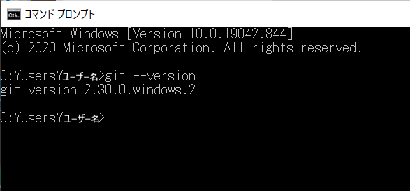

# 事前準備
以下3つのインストールとGitHubの登録をしてください。  
インストールの際は、すべてデフォルトでOKです。  

**R**  
<https://cran.r-project.org/>

**Rstudio**  
<https://rstudio.com/products/rstudio/download/>

**Git**  
<https://gitforwindows.org/>  

<br />

**GitHubの登録**  
<https://github.com/>


<br />

  
Gitをダウンロードしたら、**コマンドプロンプト**を起動します。windowsに標準で付属されているので、デスクトップ左下の検索バーに**「コマンドプロンプト」**と打てば出てくるはずです。  
コマンドプロンプトの代わりにGit Bashを利用しても構いません。Git BashはGitをダウンロードした際に付属してきているはずです。  
今後よく利用するので、どちらかを起動しやすい場所に置いておくことを薦めます。  

Gitは初期設定が必要なので、設定します。  
まずGitが正常に動くかどうかを確認します。以下のコマンドを打ちEnterを押し、**git version ~~~**と表示されれば問題ありません。
```
git --vesrsion
```



次に、以下のコマンドを実行してください。ユーザー名とメールアドレスは直接見られることはないため、自分の好きなもので構いません。

```
git config --global user.name "ユーザー名"
```
```
git config --global user.email メールアドレス
```

これで初期設定は終了です。次に使う時まで、コマンドプロンプトはそのまま閉じて構いません。