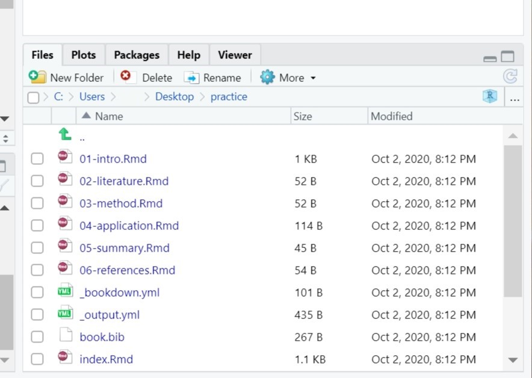

# bookdownの準備

## bookdownの環境構築
Rstudioを開きます。consoleに`install.packages("bookdown")`と入力します。（下の画像参照）

 
エラーがなければ、bookdownがインストールされます。  
このbookdownパッケージでWebページなどを簡単に作ることができます。

<br />

次にbookdownを利用できるprojectを作ります。画面右上のproject (None)を選択します。


順に  
New Project...  
↓  
New Diretory  
↓  
Bookdown Project using bookdown  
を選択。  

<br />
Directory nameは例として**practice**とします。(名前は何でも構いません。)  
Create project as subdirectory of: はフォルダを置く場所を選択します。デスクトップなど自分の使いやすい場所を選択しましょう。  

<br />

ここで、このプロジェクトフォルダのGitの設定もしておきます。  
画面中央上部のToolsからProject Options...を選びます。


<br />


GIT/SVNのVersion control system:を(None)からGitに変更します。OKを押すとRstudioの再起動を求められるので、再起動させましょう。  
（この操作は`git init`と同じような操作です。）

<br />

これで、このpracticeというフォルダはGitの管理下に置かれることになりました。（Gitについてはまだよくわからなくて構いません。）


## bookdownで使用されるファイル
今、Rstudioの右下の画面には現在のディレクトリ内のフォルダが表示されていると思います。  
以下ようなファイルが、practiceプロジェクトに入っています。

これはbookdownがデフォルトで用意してくれるファイルです。これらにWebページの内容や設定を記述することでwebページが作られます。後で中身を書くので、今は特に触る必要がありません。以下に簡単に説明だけしておきます。

<br />

+ .Rmd:ページの中身になります。
    + index.Rmd：サイトのトップページになります。  
+ _bookdown.ymlと_output.yml：出力方法や、全体の設定を行います。  


<br />

後でGitHubでの公開を簡単にするため、以下のように_bookdown.ymlに記述します。  
```
output_dir: "docs"
```
（Githubはdocsフォルダの中身をサイトとして公開することができます。今は分からなくてよいので無心で記述してください。）

