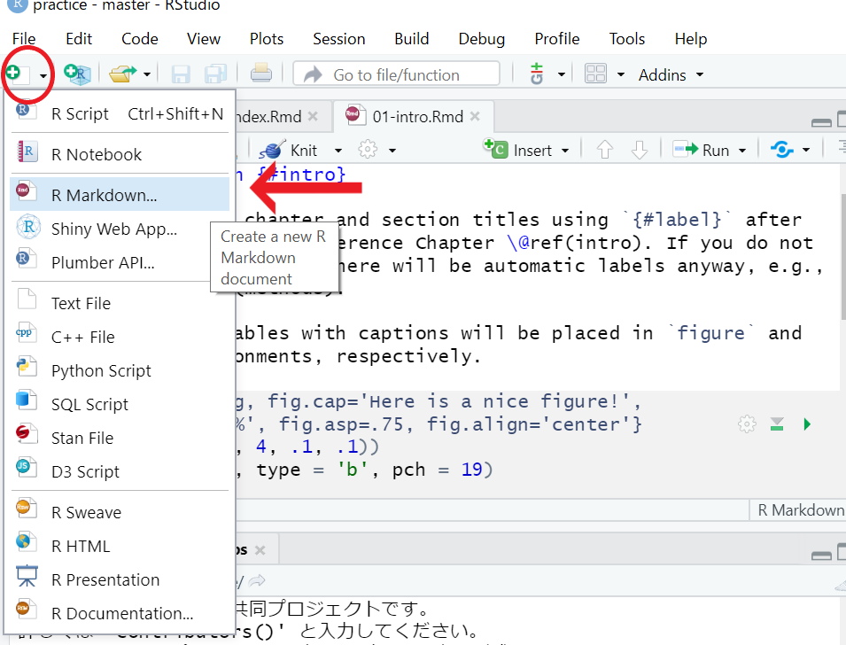
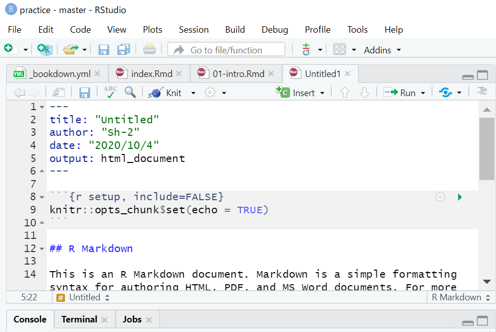

# ページの編集
このchapterでは、テンプレを書き換えて自分の好きなサイトを作っていきます。

<br />

すべて説明しきれないため、あまり深入りせずに簡潔に説明します。詳しくは**[公式](https://bookdown.org/yihui/bookdown/)**で確認お願いします。  
もしくは**[私のリモートリポジトリ](https://github.com/sh-2/Rstudio_bookdown/archive/master.zip)**から、このサイトのプロジェクトフォルダをダウンロードして、見比べながら作業してみてください。

<br />

## _bookdown.yml

`output_dir: "docs"`を追記するだけで構いません。(chapter 2参照)  
Githubはdocsというフォルダがあれば、その中身をWebサイトとして公開してくれるため、このように指定しています。  


## _output.yml

```
bookdown::gitbook:
  css: style.css
  config:
    toc:
      before: |
        <li><a href="./">　ここにサイトタイトルを書きます　</a></li>
      after: |
        <li><a href="https://github.com/rstudio/bookdown" target="blank">Published with bookdown</a></li>
    download: ["pdf", "epub"]
bookdown::pdf_book:
  includes:
    in_header: preamble.tex
  latex_engine: xelatex
  citation_package: natbib
  keep_tex: yes
bookdown::epub_book: default
```

サイトタイトルの部分に好きなタイトルを書きましょう。このサイトだと左上の**「bookdownとGitHubでWebpage制作」**の位置に当たります。  
<br />
_output.ymlでは出力されるhtmlの構成を変える設定などを記述できます。(html widgetを多く使う場合などで、必要になるかもしれません。多くの場合、気にする必要はありません。)


## .Rmdファイル（Rマークダウンファイル）
Rmdファイルは本文に当たる部分です。マークダウン記法で記入していき、これがbuild時にhtmlに変換されます。  

マークダウンの書き方は、検索すれば良いサイトが多くあります。自身で調べてみてください。参考に一つ挙げておきます。  
[Qiita マークダウン記法 一覧表・チートシート](https://qiita.com/kamorits/items/6f342da395ad57468ae3)


### index.Rmd
このサイトの**「初めに」**のようなトップページに当たります。  
本文はマークダウン記法で記入しますが、index.Rmdのみ`---`で囲まれた中に設定を書く必要があります。  
とはいえ、デフォルトのものを書き換える程度なので、簡単にできます。例としてこのサイトのindex.Rmdを載せておきます。


```
---     この---に囲まれた部分はindexの設定になります。
title: "bookdownとGithubでWebサイト制作"    タイトル
author: "Sh-2"    筆者の名前
date: "`r Sys.Date()`"    更新日が自動で取得されます
site: bookdown::bookdown_site 
documentclass: book
bibliography: [book.bib, packages.bib]
biblio-style: apalike
link-citations: yes
description: "RのbookdownパッケージとGit / Gitbubを使ってWebサイトを共同で制作するための解説です。個人で作る際も参考になると思います。"     サイトの説明部分になります。
---

(ここから下がマークダウン記法で書く本文となります。)

# 初めに {-}
Rstudioでbookdownパッケージを使ってWebサイトを作る説明書として、このサイトを作りました。**とりあえずできる**ことを目的として書いており、細かい説明は極力省きました。もしかすると間違い等あるかもしれません。  
chapter 4まで読めば、webサイト制作の大枠は分かると思います。それ以降は共同でwebサイトを制作する方法について説明していきます。
```

### その他Rmdファイル
テンプレートの`01-intro.Rmd`などは消してしまい、自身がわかりやすいRmdファイルを作り直すことをお勧めします。Rstudioの左上から新しいRmdファイルを作ることができます。  
(buildする際はRmdの名前順にhtmlが生成されるため、命名には注意してください。ここでは触れませんが_bookdown.ymlで順番を指定することもできます。)  




<br />

R markdown...を選択した後、TitleとAuthorを求められますがすぐに消すので、書かなくて構いません。  

Rmdファイルが作られると,以下のように色々と書かれていると思いますが、


すべて消してください。そして以下のようにチャプタータイトルから書き始めます。


<br />

```# タイトル```の後にいきなり本文から書き始めて構いません。タイトルの部分がchapter名となり、それ以降が本文となります。  
bookdownでレンダリングする際、Rmdファイルは名前順でページになるので、注意してください。  

例としてchapter 4のRmdファイルを一部載せます。  
```
# ページの編集
このchapterでは、テンプレを書き換えて自分の好きなサイトを作っていきます。

<br />

すべて説明しきれないため、あまり深入りせずに簡潔に説明します。詳しくは**[公式](https://bookdown.org/yihui/bookdown/)**で確認お願いします。  
もしくは**[私のリポジトリ](https://github.com/sh-2/Rstudio_bookdown/archive/master.zip)**から、このサイトのプロジェクトフォルダをダウンロードして、見比べながら作業してみてください。

<br />

## _bookdown.yml

`output_dir: "docs"`を追記するだけで構いません。(chapter 2参照)  
Githubはdocsというフォルダがあれば、その中身をWebサイトとして公開してくれるため、このように指定しています。  

```

## Build
ここまでできれば、あとはBuildするだけです。  
knitでプレビューしておき、問題がなければBuild Bookをクリックしましょう。(index.Rmdのknitは必須です。)

## GitHubへの更新
重複しますが、以下のコードをコマンドプロンプトで打てば更新されます。Build Bookが完了した後に行いましょう。
```
git add .
```
```
git commit -m "コメント"
```
```
git push origin master
```
pushのあとで、しばらく待ってからサイトを見てみましょう。更新されているはずです。


<br />
ここまでで、webサイトの作り方は一通り終わりです。より詳しい設定をする場合、**[公式](https://bookdown.org/yihui/bookdown/)**などで各自確認願います。特に_bookdown.ymlや_output.ymlはまだまだ設定できる項目が多くあります。  

これ以降のchapterでは共同でサイトを作っていく方法を紹介して行きます。（ここまででサイトは作ることができるため、必要のない方は以降のchapterを読む必要はありません。）