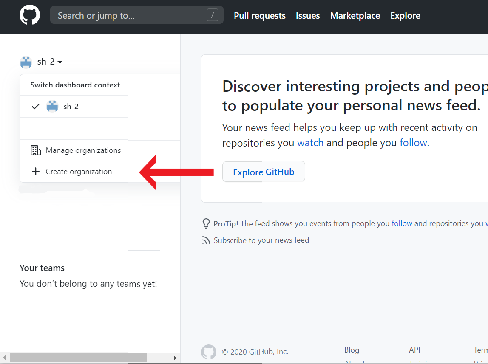
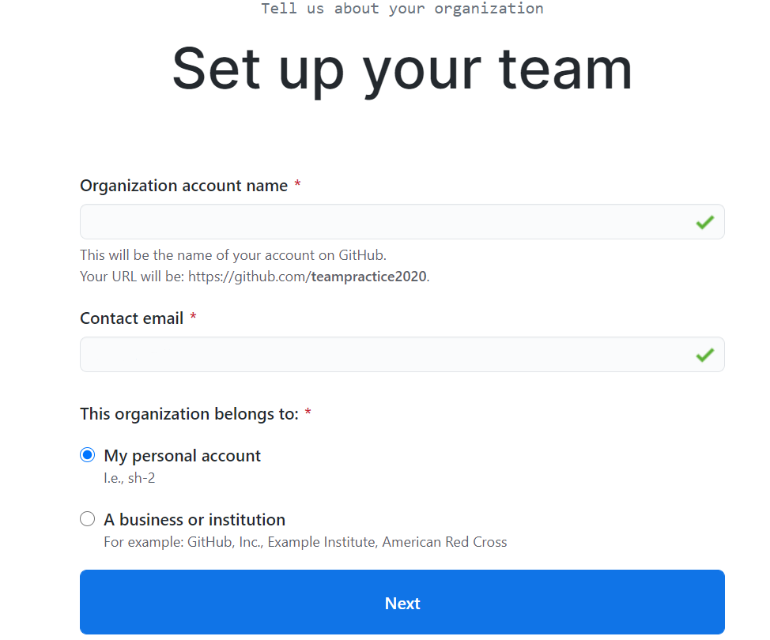
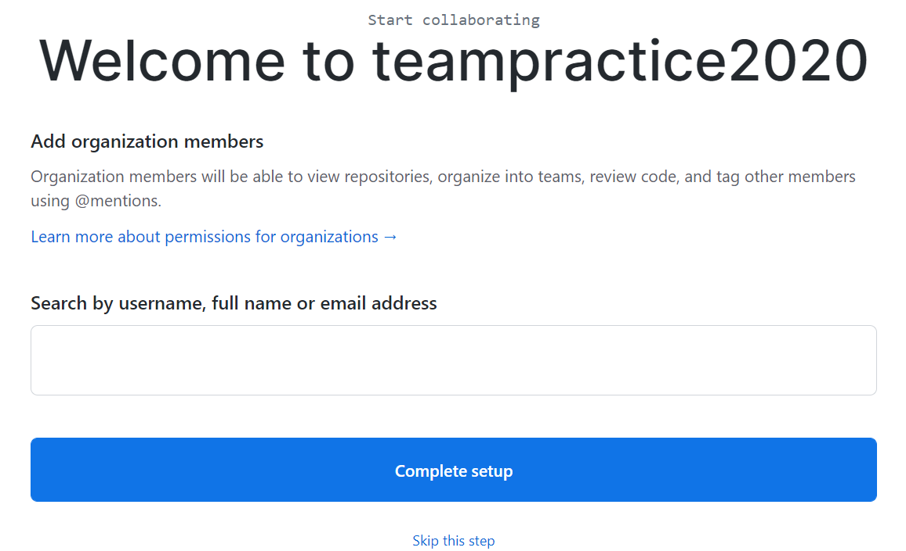
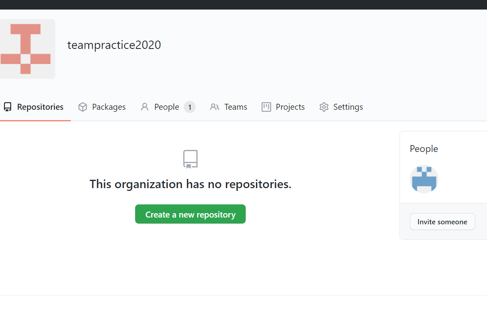
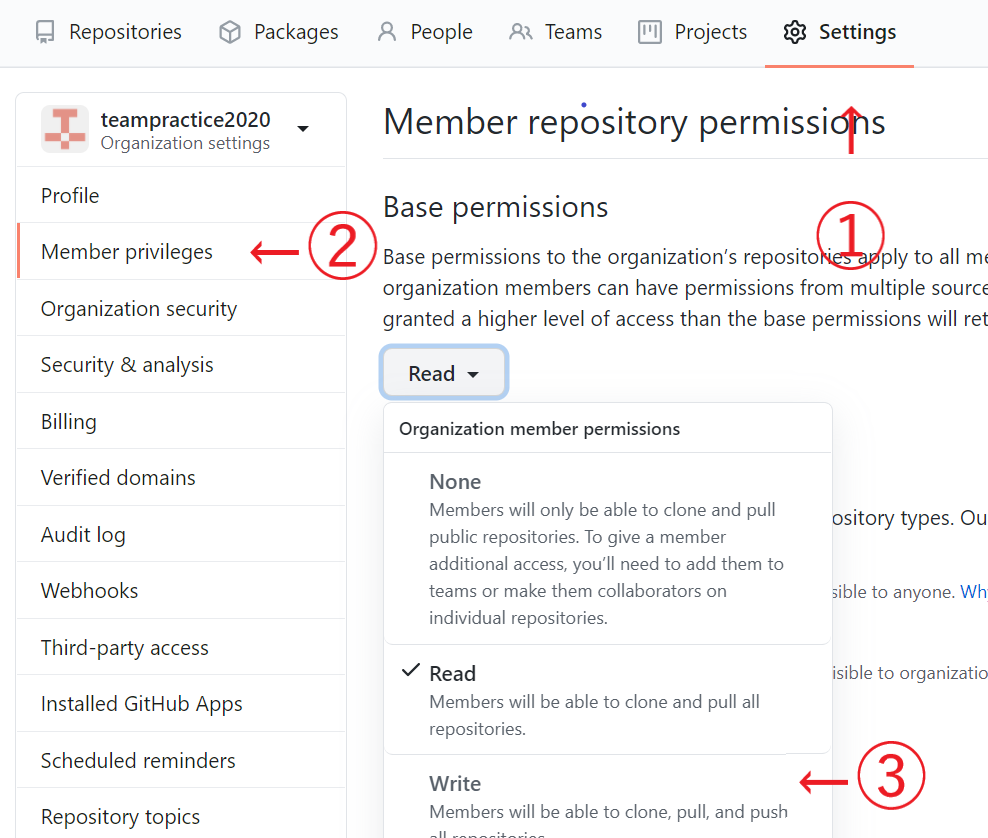

# webサイト共同制作(branch無し)

## 共同のorganizationを作成する

まずはGitHubで共同でリポジトリを管理できるorganizationを作りましょう。  


<br />
次の画面ではFreeのプランを選んでいただいて構いません。  

<br />
その次はSet up画面です。それぞれ入力してください。  
emailはリーダーのアドレスを選択すればよいでしょう。organizationのタイプはpersonal accountで大丈夫です。  

<br />

以下の画面で共同制作者を招待します。もしここでできなくても後での招待も可能です。


<br />

次の画面でアンケートのようなものが表示されます。答えても答えなくてもどっちでも大丈夫です。 

<br />

その後、以下の画面が表示されればorganizationの完成です。


<br />

最後に共同で管理するため、設定を行いましょう。
SettingからMember privilegesを選択し、Base permissionsをwriteに変更しておきましょう。

<br />
以降、このorganizationの中でリポジトリを作成すると、参加者が共同で使うことができるリモートリポジトリになります。リーダーはこのリモートリポジトリに、bookdownのプロジェクトをアップロード(push)しましょう。


## 共同でリモートリポジトリを使う(初回)
共同制作者は、リーダーが作ったリモートリポジトリを自分のローカル環境にも持ってくることで編集することができます。

```
cd パス   #デスクトップなどを作業しやすい場所まで移動
git clone URL   #URLはリモートのものをコピペ。リポジトリが複製される。
```

これでデスクトップ上に、リモートリポジトリのフォルダが複製されます。  
このフォルダの中身のRmdなどを編集しましょう。knit, Build Bookを行ったら、pushまで行います。


```
git add .
git commit -m "コメント"    #他の制作者が分かりやすいコメントが望ましい
git push origin master
```

これで共同のリモートリポジトリに編集内容がアップロードされました。

## 共同でリモートリポジトリを使う(2回目以降)

共同のリモートリポジトリで他の誰かがpushを行っても、`git clone`で複製されたローカルリポジトリには、その変種内容は反映されません。作業を始める前には必ず、`git pull`を行いましょう。

```
git pull origin master    #リモートの最新情報をローカルに反映
```

この後で編集を行いpushしましょう。  

<br />

共同リモートリポジトリのマスターブランチ(origin master)にアップロードする方法は比較的簡単です。ただし皆が同じブランチを扱うため競合が起きたり、いくつか問題があります。  
問題を起こさないためには、pushしたあとは必ずメンバーに伝える。`pull→push`の一連の流れの中で、他の人のpushがされないようにする。などに注意しましょう。　　

<br />

次の章ではbranchを使った共同作業の説明をします。  
ここまででも十分、共同でサイトを更新できます。branchの概念は少し難しいので、以降読まなくても大丈夫です。