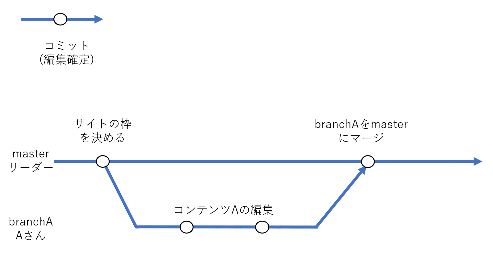
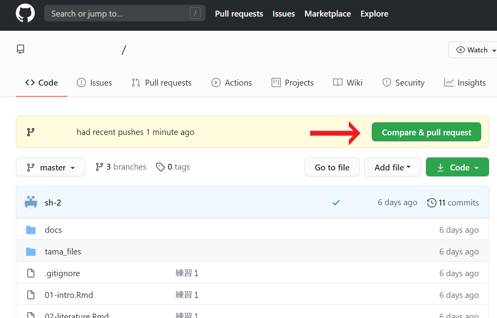
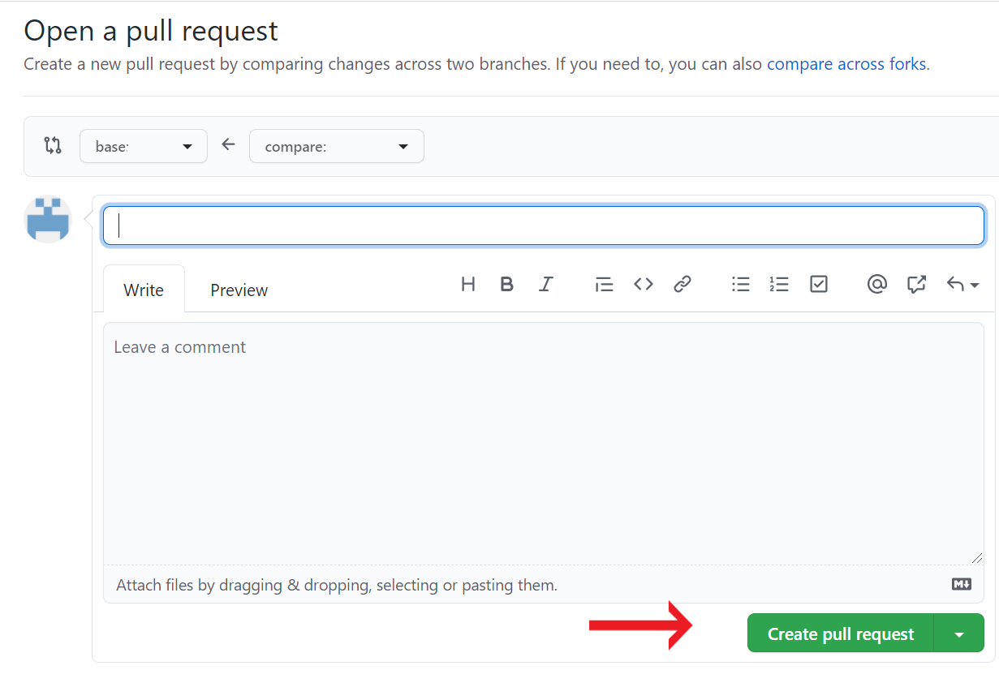
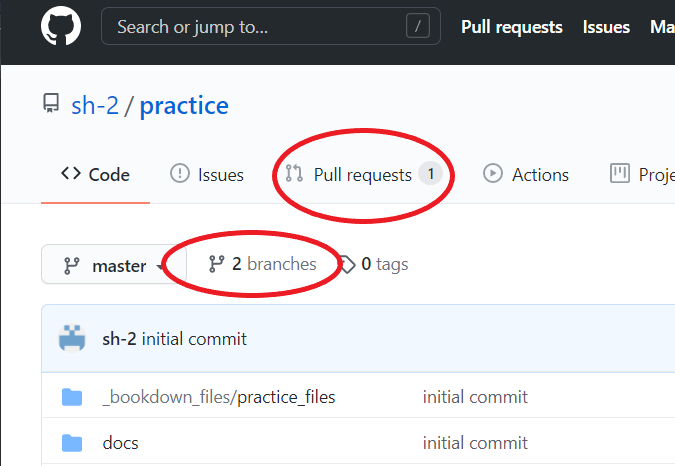
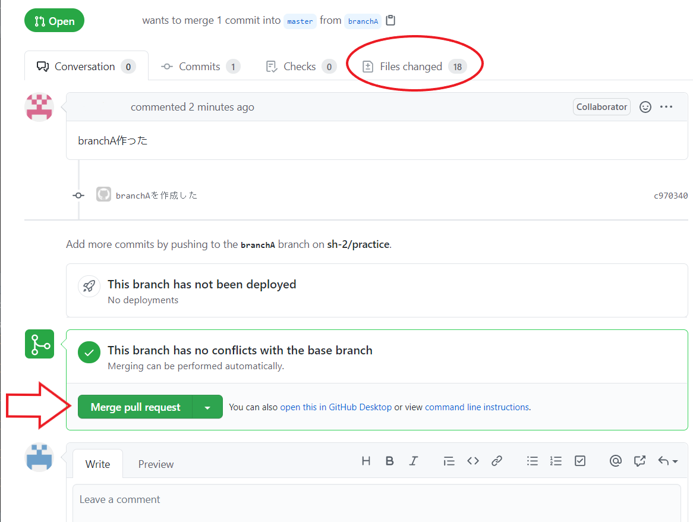
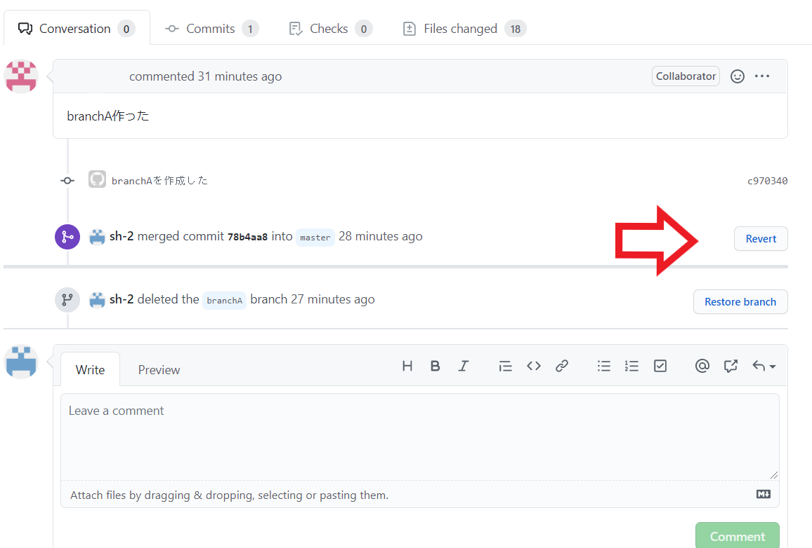

# Git & GitHubを中心に共同制作

## 作業フロー
<br />
以下のように作業環境を設定します。

+ master：最終的に完成形となる公開用の本流。リーダーが管理。
+ branchA：コンテンツAを作るブランチ。Aさんが担当。


このように各々がブランチで担当コンテンツを作り、完成したらmasterにマージするような流れで行っていきます。


そもそも何故ブランチを使うかというと、masterに各々がpushしてしまうとそれぞれの編集が被ってpushできなかったり、誤った編集でmasterをダメにしてしまうことを避けるためです。ブランチでの作業はmasterには影響を与えないため、各自編集を行って構いません。  

<br />

## リモートリポジトリを自分の端末にコピー
ではAさんを例にとって、Aさん視点で見てみましょう。  
リーダーがリモートリポジトリに、最低限のサイトの枠組みを作りました。これからそのサイトのコンテンツを、Aさんが作っていきます。  
<br />
まずAさんは自分の端末に、リーダーが作ったリモートリポジトリをコピーしなければなりません。chapter 3と同じように、Githubから共同のリモートリポジトリのURLをコピーします。次にコマンドプロンプトで以下の操作をします。
```
cd ~~   #コピーしたい場所まで移動（デスクトップなど）
git clone リモートリポジトリURL    #リモートリポジトリを丸々自分のPCコピー。
```
これでAさんのPCにリーダーの作ったリモートリポジトリがコピーされました。  
次にAさんは、自分が作業するブランチを作ります。

```
cd コピーしたフォルダ    #コピーしたリモートリポジトリのフォルダへ移動
git branch    #今あるブランチと、自分のいるブランチ(＊)を表示
git branch branchA    #masterからbranchAを分岐させる。(masterにいる状態で実行しましょう)
git checkout branchA    #branchAに移動。今後はここで編集する。
git branch    #今いるブランチ(＊)を確認（branchAにいるのか確認。）
```
<br />
これでAさんの作業環境が作られました。chapter 4を参考にしながらAさんは担当コンテンツを作ってください。  
Aさんは担当するコンテンツが4章であれば「chapter04」のようなRmdファイルを作って編集し、`knit`、`build`、`git add .`、`git commit`を行いましょう。このとき自分の関わらないファイルは触らないようにしましょう。他の人との競合が起き、pushがうまくいかなくなることがあり、少々面倒なことになります。  
<br />

その後、branchAの編集内容をリモートリポジトリにpushします。
```
git push origin branchA   #branchAの情報リモートリポジトリにアップロード
```


ここまで作業を終えたらGithub上でもbranchAというブランチが確認できます。  
次は、Github上でプルリクエストを行いリーダに内容をチェックしてもらいます。
  


## プルリクエスト
Aさんは編集内容のチェックをリーダーから受けます。そのためにGitHubでプルリクエストという機能を使います。  
branchAがpushされた後、GitHubを開くとpull requestを行うボタンが追加されています。押してみましょう。



編集内容についてコメントを残しておき、**Creare pull request**を行いましょう。リーダーが次にGitHubを開いた際、Aさんがpull requstを行ったことが分かるようになります。  
リーダーはプルリクエストに対して、コメントを返すことができ、AさんはリーダーからOKがでるまでコミットを繰り返しましょう。コミットを行うことで自動的にプルリクエストは更新されます。  

<br />

リーダーはプルリクエストのOKを出した後、masterとbranchAのmergeを行います。(次の**[8.4 マージ](#マージ)**を参照)  
mergeされたのを確認したら、Aさんはリモートリポジトリの最新情報をローカルリポジトリに持ってきたうえで、不要になったbranchAを削除します。
```
git pull origin master   #ローカルをリモートの最新情報に更新
```
```
git checkout master   #masterブランチに移動
git branch    #branchAの存在、masterにいることを確認
git branch -d branchA   #branchAの削除
git branch    #branchAが消えているのか確認
```
これでローカル環境にあったbranchAが削除できました。  
mergeされ必要のなくなったブランチを削除することは必ずしも必要な訳ではありません。しかし余分なブランチを残しておくと管理が煩雑になるため、適切なタイミングで消していくことをお勧めします。  
ただし、消す際には十分注意しましょう。もしも間違えてしまった場合は、pushせずに、ローカルのフォルダをすべて消して、`git clone`をしてやり直すのが良いかもしれません。


## マージ
ここからはリーダー視点です。
Aさんがプルリクエストを行った後、Github上ではブランチが増え、プルリクエストがあることが示されています。



リーダーはpull requestを確認し、もし作業内容に問題がある場合は、コメントをつけてAさんに返事を返すことができます。問題がなくなるまでAさんとやり取りを行いましょう。
問題がなくなれば、mergeを行います。mergeを行うことでbranchAの情報がmasterブランチに取り込まれます。  
(変更されたファイルは、Files changedから確認できますがbuildを伴うと大量の変化があるためなかなか見切れません。そのため大きな問題がないと思われれば、mergeしてしまっても良いかもしれません。)　　

<br />
mergeは簡単です。pull requestの画面のしたにある**Merge pull request**、それから**confirm merge**を押すだけです。

<br />

mergeを終えた後、branchAは不要なため削除してしまって構いません。削除する際はブランチを確認したうえで間違えないようにしましょう。  
<br />
ブランチの削除もGithub上でできます。**Delete branch**を押してください。


ブランチの削除を終えたら、リーダーは`pull`を行い最新のリモートリポジトリの情報をローカルに持ってきます。
```
git pull origin master    #リモートのmasterの最新情報をローカルに持ってくる
```
追加で必要な作業がある場合は、このようにgit pullをしたうえで、作業をするようにしましょう。

<br />

もしもbranchAを消す前の状態に戻したいということがあれば、Github上でもう一度プルリクエストの画面に戻ります。  
すると以下のように**Revert**というボタンがあるので押します。これでmergeする前の状態に戻ります。


この後で`git pull origin master`を行えば、ローカルリポジトリをリモートと同じ状態にすることができます。


## 作業まとめ
以下にAさんとリーダーの基本作業フローをまとめました。    


### Aさんの行動 -プルリクエストまで-
Aさんが共同制作に参加することになったら...
```
git clone URL   #共同のリモートリポジトリをローカルにコピー
```
```
git branch branchA    #masterからbranchAを分岐させる
git checkout branchA    #branchAに移動
git branch    #今branchAにいるのかをを確認
```
branchAでコンテンツAを編集。完成したら`knit` → `Build`し...
```
git add . 
git commit -m "コメント"    #編集の確定
git push origin branchA    #branchAの情報をpush（アップロード）
```
ここまで行った後、AさんはGitHub上でリーダーにプルリクエストし一旦終了です。  

<br />

プルリクエストが受理され、branchAがmergeされたのを確認したら...
```
git pull origin master    #ローカルをリモートの最新情報に更新
```
```
git checkout master   #masterブランチに移動
git branch    #branchAの存在、masterにいることを確認
git branch -d branchA   #branchAの削除
git branch    #branchAが消えているのか確認
```


### リーダーの行動 - プルリクエストを受けた後-


GitHub上でbranchAをチェック。問題があればコメントを書いてAに返します。問題がなくなりmasterにマージさせてよい状況であれば、merge pull requestを行います。

<br />

mergeを終えたらbranchAを削除しましょう。
そのあとで`git pull origin master`を行いローカルの情報を、リモートの最新情報に合わせておきましょう。


## プルリクエスト & merge後の追加作業
プルリクエストとmergeを終えた後に追加で作業する場合を説明していきます。  
追加で作業する場合、まずmerge後のリモートリポジトリの最新情報をローカルリポジトリに持ってこなければなりません。  
プルリクエストとmergeはGithub上で実行されています。そのためリーダー、Aさんの二人ともローカル環境に、mergeされた後の情報がないためです。つまり`pull`を行います。  
(新規に他の人が参加する場合は[「8.2 リモートリポジトリを自分の端末にコピー」](#リモートリポジトリを自分の端末にコピー)の作業を開始してください。)

<br />
```
git pull origin master   
```

これでのローカルリポジトリのmasterも最新状態になりました。
Aさんは再びmasterから新しいブランチを切って、作業を行いプルリクエストを行ってください。  

